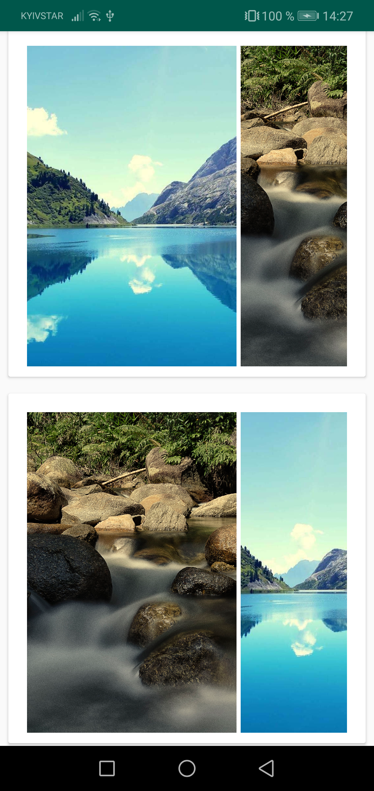
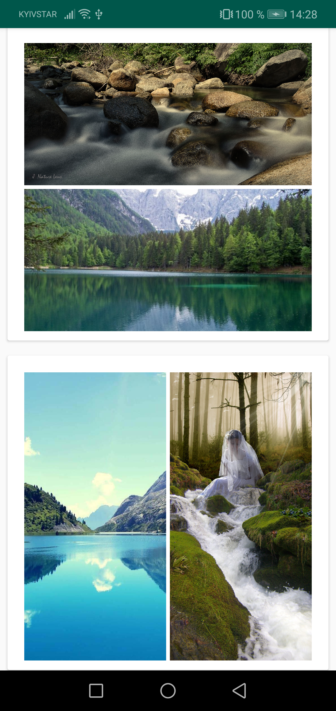
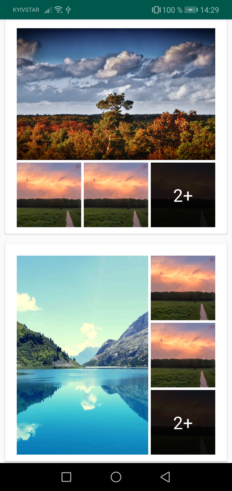

[](https://jitpack.io/#GrishinSergey/CollageImageView)

<h3>CollageImageView</h3>

<p>
This app is an example. how to create collages with RecyclerView. Here are several examples, how it looks like:
</p>

  
 
 

<p>If you have too mutch images, they will be shown like this:</p>
<br>
 

<h3>Installation</h3>
<p>1) If you have not added Jitpack to your repositories, add it:</p>

```gradle
allprojects {
    repositories {
        ...
        maven { url 'https://jitpack.io' }
    }
}
```
<p>2) Then add to your app (or another module, where you will use the lib) this dependency:</p>

```gradle
implementation 'com.github.GrishinSergey:CollageImageView:v2.0.0'
```

<p>3) In your layout you should place this:</p>

```xml
<com.sagrishin.collageview.CollageView
    android:id="@+id/collageViewId"
    android:layout_width="match_parent"
    android:layout_height="wrap_content" />
```

<p>And in your source you should place next code.</p>

One of major changes between v1 and v2 is that now it is necessary to provide previewer. This is the way, how this lib supports different libraries for previewing images. Look to app module to see details
```kotlin
collageViewId.itemPreviewLoader = GlideItemPreviewLoaderImpl.Builder(context).build()
```

Now it is possible to set radius for images in collage. Just paste value in dp in collage to make it rounded
```kotlin
val radius = TypedValue.applyDimension(
    TypedValue.COMPLEX_UNIT_DIP,
    4F, // the radius value
    context.resources.displayMetrics
).toInt()
```

Here is an example, how to fill list of urls to images. Let's say you have list of images from your API, so you can convert them to CollageItemUrlData
```kotlin
val images = photos.map { singlePhoto ->
    CollageItemUrlData(singlePhoto.url).apply {
        this.width = singlePhoto.width
        this.height = singlePhoto.height
    }
}
```

Last, which is necessary, call setup method. It takes now three params:
- list of CollageItemUrlData,
- radius
- listener of clicks
```kotlin
collageViewId.setup(images, radius) { position ->
    Toast.makeText(context, "clicked position is $position", Toast.LENGTH_SHORT).show()
}
```

<h3>What should be upgraded:</h3>
<ol>
  <li>Make thumbnail and error holders which will be shown, if image still loading or if an error acquired</li>
  <li>Make params of CollageView::setup optional</li>
  <li>Create proguard file</li>
</ol>
