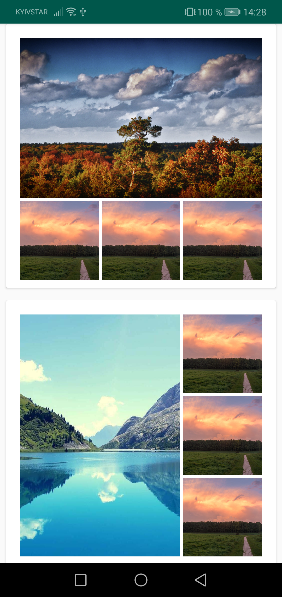

<h3>CollageImageView</h3>

This app is an example. how to create collages with RecyclerView. Here are several examples, how it looks like:

  
 
 

If you have too mutch images, they will be shown like this:

 
 
